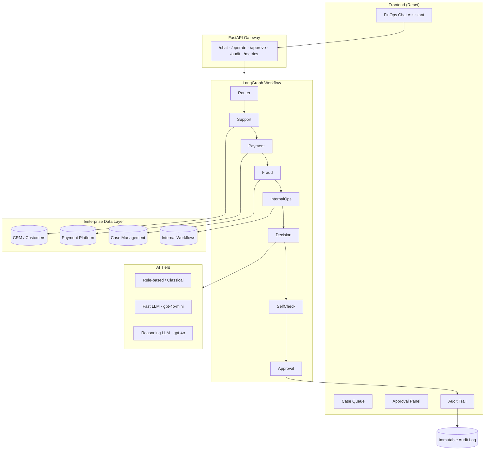

# Architecture — Agentic Financial Operations Assistant

## Overview

FinOps Assistant is a multi-agent AI system that autonomously handles banking operational tasks across customer support, payments, fraud investigations, and internal ops — while keeping humans in the approval loop for high-risk actions.

## System Architecture

## Agent Pipeline (9 Specialized Agents)

| Agent | Role | Model Tier | Data Source |
|-------|------|------------|-------------|
| **Router** | Classifies request → support/payment/fraud | Rule-based | Request metadata |
| **Support** | CRM context, ticket history | Fast LLM / Rules | `customers.json`, `tickets.json` |
| **Payment** | Transaction review, dispute detection | Fast LLM / Rules | `transactions.json` |
| **Fraud** | Risk scoring, flag identification | Reasoning LLM (high risk) | `fraud_cases.json` |
| **Internal Ops** | Workflow bottlenecks, pending approvals | Rule-based | `internal_workflows.json` |
| **Decision** | Final action recommendation | Reasoning (high stakes) | All summaries |
| **Self-Check** | Validates against business guardrails | Rule-based | Decision output |
| **Approval** | HITL gate for irreversible actions | Rule-based | Policy thresholds |
| **Audit** | Immutable logging with plain-language reasons | Rule-based | All state |

## Guardrails

1. **Human-in-the-Loop (HITL)**: Refunds > ₹1,000, fraud holds, account actions → pending approval
2. **Auditability**: Every action logged with timestamp, case ID, decision, reason
3. **Data Privacy**: No full PAN/Aadhaar exposure; RBI-aligned handling
4. **Explainability**: Plain-language reason + customer-facing explanation on every decision
5. **Self-Check**: Pipeline validates its own output before finalizing

## Cost Model

| Tier | Use Case | Cost/1K tokens | Typical Cost/Decision |
|------|----------|----------------|----------------------|
| Rule-based | Routing, audit, self-check, low-risk | $0.00 | ~$0.000001 |
| Fast LLM | Support/payment summaries | $0.00015 | ~$0.0001 |
| Reasoning LLM | Fraud assessment, high-stakes decisions | $0.003 | ~$0.003 |

**Average cost per transaction (MVP)**: ~$0.0001 USD with rule-based mode; ~$0.005 with mixed LLM tiers.

## Tech Stack

- **Backend**: Python 3.11+, FastAPI, LangGraph, Pydantic
- **Frontend**: React 19, Vite
- **AI**: OpenAI (optional) with rule-based fallback
- **Data**: JSON enterprise mock data (CRM, payments, fraud, ops)
- **Infrastructure**: Docker Compose (MySQL ready), uvicorn

## API Endpoints

| Method | Path | Description |
|--------|------|-------------|
| POST | `/chat` | Conversational assistant |
| POST | `/operate` | Structured operation request |
| POST | `/approve` | Human approval/rejection |
| GET | `/cases` | List all cases |
| GET | `/cases/pending-approval` | HITL queue |
| GET | `/audit` | Audit trail |
| GET | `/metrics` | Cost and volume metrics |
| GET | `/customers` | CRM customer list |
