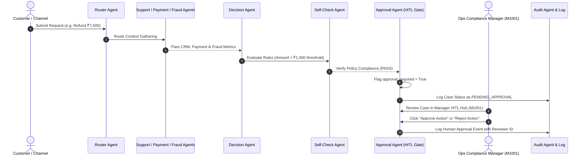

# Guardrails & RBI Compliance Document — Agentic FinOps Assistant

> **AI Build 2026 Submission Document**  
> **Track**: Agentic Financial Operations Assistant  
> **Topic**: Technical Specification & Implementation Guide for Mandatory Guardrails

---

## Executive Summary

The **Agentic Financial Operations Assistant** is built around four mandatory enterprise guardrails required for autonomous financial systems under Indian Banking & RBI regulations:
1. **Human-in-the-Loop (HITL)**
2. **Auditability**
3. **Data Privacy (RBI & DPDPA Alignment)**
4. **Explainability**

This document details the architectural design, policy thresholds, code implementations, and compliance frameworks governing each guardrail.

---

## 1. Human-in-the-Loop (HITL) Guardrail

### 1.1 Policy Threshold Matrix
To prevent irreversible financial loss or unauthorized customer account modifications, autonomous actions are strictly gated based on risk and value thresholds:

| Operation Type | Threshold / Condition | Agent Decision | HITL Approval Status | Execution Path |
| :--- | :--- | :--- | :--- | :--- |
| **Micro Refund** | Amount $\le$ ₹1,000 & Risk Score $< 70$ | `APPROVE` | `auto_approved` | Autonomous Execution |
| **High-Value Refund** | Amount $>$ ₹1,000 | `APPROVE` | `pending` | Manager Queue (`/cases/pending-approval`) |
| **Fraud Investigation** | Risk Score $\ge 70$ OR Velocity Spike | `ESCALATE` | `pending` | Manager Queue & Account Hold |
| **Routine Support** | Balance / Ticket Status Inquiry | `RESOLVE` | `auto_approved` | Immediate Support Reply |

### 1.2 HITL Workflow Sequence Diagram



### 1.3 Role-Based Access Control (RBAC)
- **Customer Portal (`C1001` / `bank123`)**: Access restricted to personal accounts, domestic transfers, cash withdrawals, and general AI assistance. Internal manager queues are strictly hidden.
- **Manager Governance Hub (`M1001` / `admin123`)**: Authorized compliance portal equipped with live pending approval queues, case reviewer actions (`POST /approve`), and audit metric dashboards.

---

## 2. Auditability Guardrail

### 2.1 Immutable Log Specification
Every autonomous decision, self-check result, and human reviewer action is recorded with an immutable schema.

```json
{
  "timestamp": "2026-08-08T09:40:00Z",
  "case_id": "729F9701",
  "customer_id": "C1001",
  "account_id": "A2001",
  "request_type": "refund",
  "amount": 7500.0,
  "decision": "approve",
  "action": "issue refund pending manager approval",
  "approval_required": true,
  "approval_status": "pending",
  "self_check": "Self-check PASSED: decision aligns with guardrails (HITL, auditability, explainability).",
  "reason": "Refund of ₹7,500 exceeds ₹1,000 threshold — human approval required.",
  "reviewer": null,
  "agent_trace": [
    {"agent": "Support Agent", "summary": "Support context for Priya Sharma..."},
    {"agent": "Payment Agent", "summary": "Payment review for ₹7,500..."},
    {"agent": "Fraud Agent", "summary": "Fraud assessment: risk score 15/100..."},
    {"agent": "Decision Agent", "summary": "Decision: approve. Recommended action..."},
    {"agent": "Self-Check Agent", "summary": "Self-check PASSED..."},
    {"agent": "Approval Agent", "summary": "Queued for human approval (HITL)"},
    {"agent": "Audit Agent", "summary": "Logged to immutable audit trail"}
  ]
}
```

### 2.2 Audit Endpoints & Persistence
- **JSONL Storage**: Persisted under `logs/audit_trail.jsonl`.
- **Audit Endpoint**: Exposed via `GET /audit?limit=50` for compliance auditors.
- **Metrics Endpoint**: Exposed via `GET /metrics` reporting total cases, pending HITL count, auto-approved count, and AI decision costs.

---

## 3. Data Privacy Guardrail (RBI & DPDPA 2023)

### 3.1 Regulatory Alignment
- **Digital Personal Data Protection Act (DPDPA 2023)**: Customer personal financial data is processed strictly for specified operational intents (disputes, refunds, support).
- **RBI Master Directions**: Adheres to RBI guidelines on Cyber Security Framework, Digital Payment Fraud Reporting, and Customer Protection (limiting liability of customers in unauthorized electronic banking transactions).

### 3.2 PII & Secret Masking Rules
- **PAN / Aadhaar Protection**: LLM System Prompts contain hard guardrails:  
  *`"Never expose full PAN, Aadhaar, CVV, or 16-digit card numbers in response text or trace summaries."`*
- **Masking Examples**:
  - Full Card Number: `•••• •••• •••• 4412`
  - Aadhaar: `•••• •••• 9812`
  - PAN: `•••••1234F`

### 3.3 Data Isolation & Scoping
- In-memory data store filters customer data by authenticated session ID.
- Customers cannot query or inspect other customer accounts or global audit logs.

---

## 4. Explainability Guardrail

### 4.1 Plain-Language Explanations
Every case decision includes two levels of human explanation:
1. **Short Policy Reason (`reason`)**: Concise rule statement (e.g. *"Refund of ₹7,500 exceeds ₹1,000 threshold — human approval required"*).
2. **Detailed Contextual Explanation (`explanation`)**: Natural language summary synthesized by `DecisionAgent` explaining the rationale, data points evaluated, and recommended next steps.

### 4.2 Self-Check Verification Gate (`SelfCheckAgent`)
Before any response is returned to the user or manager, `SelfCheckAgent` reviews the decision against business goals:
- Verifies if high-value actions correctly flagged `approval_required = True`.
- Verifies if fraud signals (velocity spikes / score $\ge 70$) triggered `ESCALATE`.
- Verifies that plain-language `reason` and `explanation` are non-empty.
- **Failure Recovery**: If a self-check fails, the system automatically overrides the decision to `ESCALATE`, flags `approval_required = True`, and routes the case to human review.

### 4.3 Agent Pipeline Traceability
Every response includes the full **Agent Pipeline Trace**, showing the exact input/output summary for each of the 9 cooperating agents:
`Support Agent` → `Payment Agent` → `Fraud Agent` → `Internal Ops Agent` → `Decision Agent` → `Self-Check Agent` → `Approval Agent` → `Audit Agent`.

---

## Summary Compliance Matrix

| Hackathon Requirement | System Module / File | Verification Command | Compliance Result |
| :--- | :--- | :--- | :--- |
| **Human-in-the-Loop** | [`agents/approval_agent.py`](file:///c:/AI-Banking-Agent/agents/approval_agent.py) | `python -m pytest` | ✅ PASS (HITL Queue Active) |
| **Auditability** | [`agents/audit_agent.py`](file:///c:/AI-Banking-Agent/agents/audit_agent.py) | `GET /audit` | ✅ PASS (Plain-language logs) |
| **Data Privacy** | [`utils/llm.py`](file:///c:/AI-Banking-Agent/utils/llm.py) | System Prompt Inspection | ✅ PASS (RBI/DPDPA Aligned) |
| **Explainability** | [`agents/decision_agent.py`](file:///c:/AI-Banking-Agent/agents/decision_agent.py) | `POST /chat` | ✅ PASS (Plain-language rationale) |
